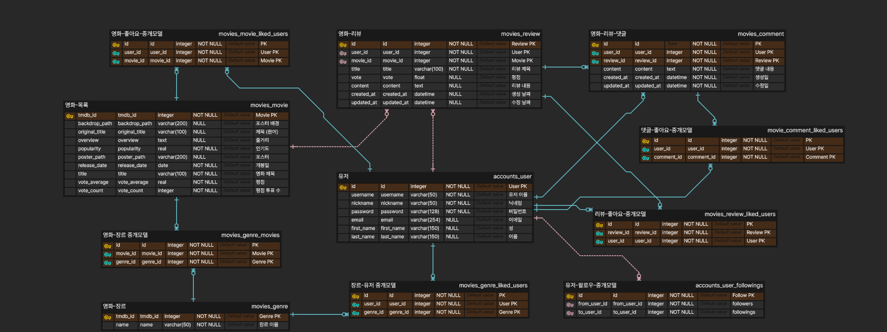

# Mingle
## SSAFY 11기 관통 Project (영화)

## 개발에 사용된 기술 스택
### Backend: Django 4.2 + Python 3.9
* [`Django REST framework`](https://www.django-rest-framework.org/)
* [`Django-Rest-Knox`](https://jazzband.github.io/django-rest-knox/)
* [`django-cors-headers`](https://github.com/adamchainz/django-cors-headers)

### Frontend: Vue3 3.4 + Nodejs 20.13 (LTS)
* [`Axios`](https://axios-http.com/)
* [`Pinia`](https://pinia.vuejs.org/)
* [`pinia-plugin-persistedstate`](https://prazdevs.github.io/pinia-plugin-persistedstate/)
* [`vue-router`](https://router.vuejs.org/)
* [`Bootstrap`](https://getbootstrap.com/)
* [`Vuetify`](https://vuetifyjs.com/en/)
* [`vue-debounce`](https://github.com/dhershman1/vue-debounce)

## 업무 분담
#### 송준혁
- 외부 API 분석 및 더미 데이터 생성
- Django REST Framework 사용자 인증 관련 기능 구현
- 사용자 관련 Vue 프로젝트 비동기 처리
- `GET` 메서드 외의 요청을 처리하기 위한 DRF API 구성
- Git 프로젝트 관리

#### 김도영
- 초기 목업 구축 및 목업 기반 페이지 템플릿 및 디자인
- `GET` 메서드를 사용하는 DRF 모델별 조회 API 구축
- CRUD를 지원하는 SPA의 컴포넌트 구현
- 발표 자료 준비 및 작성

## 서비스 구현
| 구현 목표 | 구현 여부 |
| --- | --- |
| TMDB API를 활용한 영화 정보 검색 및 DB 업데이트 | O |
| 사용자 계정 구현 및 사용자간 관계 생성 | O |
| 영화별 리뷰 작성 및 리뷰 댓글 기능 제공 등을 통한 커뮤니티 형성 | O |
| 사용자가 선택한 장르에 따른 영화 추천 | O |
| 사용자가 선택한 장르와 다른 외부 요소 (ex. 날씨, 시간, 요일, 지역 등)를 고려한 영화 추천 | X |

## ERD

[ERD Cloud](https://www.erdcloud.com/d/WFFuj8wiFqqkBxNEa)

## 영화 추천 알고리즘
- 회원가입 시 사용자가 선호하는 영화의 장르 선택
- 선택한 장르와 현재일를 기준으로 한 영화 추천

## 핵심 기능
- TMDB API를 이용한 영화 데이터베이스 구축 및 영화 상세 정보 제공
- 영화별 리뷰 작성 및 댓글 기능을 통해 영화 후기 공유 커뮤니티 제공
- 좋아하는 영화 목록 저장 및 조회
- 자신이 작성한 후기 및 댓글 상세 조회
- 유저간 팔로잉-팔로우 관계 형성

## 후기
#### 송준혁
- 프로젝트 진행에 있어 기획의 중요성을 실감할 수 있는 기회였다. 처음 진행한 프로젝트였기에, 타임라인별 진행 과정과 각 진행 과정상 필요한 절차에 대한 경험이 부족하여 일관성 있는 흐름으로 개발하는 것에 어려움이 있던 것 같다.
- 특히 프로젝트를 시작하기 이전에, 어떤 프레임워크를 사용하고 어떤 라이브러리를 사용할 것인지 계획하고, 유사한 기능을 제공하는 라이브러리가 여럿 있을 경우에의 판단 기준을 세우는 것이 중요함을 알 수 있었다. 각 프레임워크와 라이브러리의 특성과 장단을 충분히 평가하여야 이후 개발을 진행함에 있어 그것들이 걸림돌이 되지 않을 수 있을 것이란 생각이 들었다.

#### 김도영
- 일주일이라는 시간은 매우 짧았다.
- 생각보다 비동기 구현이 어려웠고, 방학동안 조금 더 공부해야겠다는 생각이 들었다.
- Vue를 사용하는 것이 어렵지 않을 줄 알았지만, pinia를 사용하다보니 데이터를 불러오는 것이나 저장해서 사용하는 것이 꽤 어려웠다.
- 처음에는 Bootstrap이 있으면 페이지 디자인이 쉬울 것 같았는데, flex를 사용하는데 어려움이 있어 carousel과 modal외에는 거의 사용하지 않게 되었다.