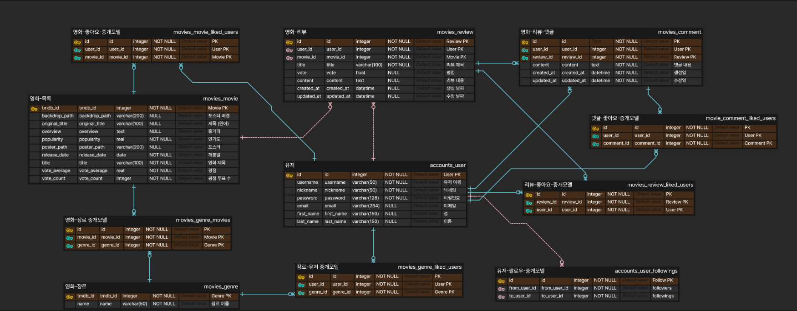

# Mingle

## 1. 업무 분담

#### 송준혁
- API & 더미 데이터 생성
- 유저 모델 관련 프론트 / 백
- 비동기 구현

#### 김도영
- 전체적인 CSS
- 기본 조회 페이지 및 상세 페이지
- 조회 관련 view, serializer 구현

## 2. 목표 서비스 구현 및 실제 구현 정도
#### 목표 
- 요일 및 날씨를 고려한 영화 추천 서비스

#### 실제
- 요일 및 사용자가 선호하는 카테고리를 고려한 영화 추천 서비스

## 3. ERD

## 4. 영화 추천 알고리즘에 대한 기술적 설명
- 회원가입 시 카테고리 선택
- 선택한 카테고리와 현재 날짜를 기준으로 한 영화 추천 서비스

## 5. 핵심 기능에 대한 설명
- 

## 6. 기타(느낀점, 후기 등)

#### 송준혁

#### 김도영
- 일주일이라는 시간은 매우 짧았다.
- 생각보다 비동기 구현이 어려웠고, 방학동안 조금 더 공부해야겠다는 생각이 들었다.
- Vue를 사용하는 것이 어렵지 않을 줄 알았지만, pinia를 사용하다보니 데이터를 불러오는 것이나 저장해서 사용하는 것이 꽤 어려웠다.
- 처음에는 Bootstrap이 있으면 페이지 디자인이 쉬울 것 같았는데, flex를 사용하는데 어려움이 있어 carousel과 modal외에는 거의 사용하지 않게 되었다.

## 7. 프로젝트 개발 툴
- django 4.2.13
- vue 3.4.21